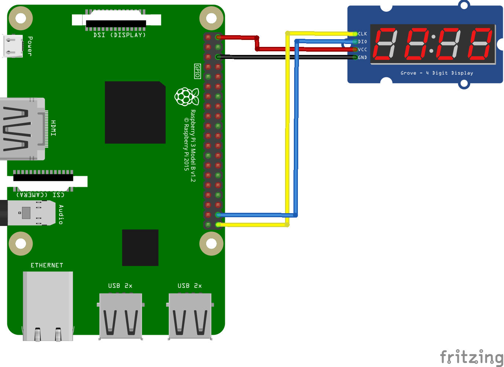

# TM1637 for Raspberry Pi 
## Installation
```bash
pip install raspberrypi-python-tm1637
git clone https://github.com/yoyojacky/tm1637forpi.git
cd tm1637forpi/
python tm1637.py
```
## Connection 


